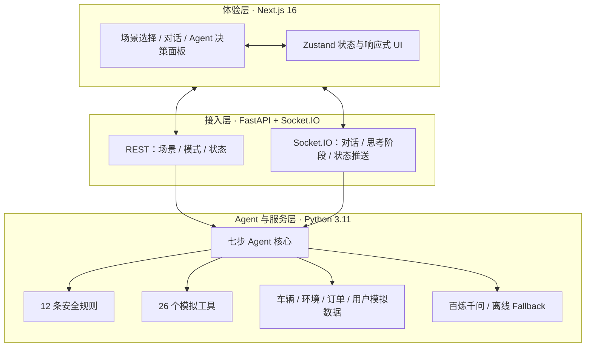

# 小鹏 AI 出行服务管家 Agent

一个面向车主用车与 Robotaxi 乘客场景的可视化 Agent Demo。系统把车辆、环境、
订单和用户上下文交给 Agent，经过意图识别、安全规则、服务编排、工具执行和自然语言
生成，返回可解释的服务计划、工具结果与 L0–L4 安全告警。

> 本项目是演示系统。车辆、人员、订单、POI 和应急调用均为模拟数据，不会控制真实车辆
> 或拨打真实紧急电话。

## 核心能力

- 8 个可一键切换的标准场景，覆盖车主与 Robotaxi 两种模式
- 七步 Agent 流水线：上下文 → 意图 → 安全 → 编排 → 工具 → 输出 → 记忆
- 12 条可配置安全规则，支持警告、拒绝、强制措施与人工/紧急服务升级
- 26 个模拟工具，覆盖座舱、导航、车况、订单与安全应急
- REST + Socket.IO 实时推送 Agent 思考阶段、车辆状态和最终结果
- OpenAI 兼容模型接口，支持结构化强校验、最多 2 次格式重试和离线 Fallback

## 三层架构



Agent 的单轮处理顺序为：

```text
获取上下文 → 意图理解 → 安全检查 → 服务编排 → 工具执行 → 输出生成 → 更新上下文与画像
```

## 技术栈

| 范围 | 技术 |
|------|------|
| 前端 | Next.js 16.3、React 19.2、TypeScript 5、Tailwind CSS 4、Base UI / shadcn、Framer Motion 12 |
| 状态与通信 | Zustand 5、socket.io-client 4.8、REST |
| 后端 | Python 3.11、FastAPI、python-socketio、Uvicorn |
| Agent | LangChain、Jinja2 Prompt、Pydantic 2、自定义安全规则引擎 |
| 模型 | 阿里云百炼 OpenAI 兼容接口；`qwen3.8-max` / `qwen3.7-flash` |
| 工程 | uv、pnpm 11、pytest、ESLint、Docker / Docker Compose、Render、Vercel |

## 本地运行（3 条命令）

前置条件：Docker Desktop 或兼容 Docker Engine，并可访问 3000 / 8000 端口。

```bash
cp backend/.env.example backend/.env
${EDITOR:-vi} backend/.env
docker compose up --build
```

在 `backend/.env` 中填写 `OPENAI_API_KEY`。如模型端点不可用，Agent 会进入可测试的本地
Fallback，但不代表真实模型调用成功。

- Web UI：<http://localhost:3000>
- 后端健康检查：<http://localhost:8000/health>
- FastAPI 文档：<http://localhost:8000/docs>

停止服务：`docker compose down`。

### 原生开发模式（可选）

```bash
cd backend && uv sync && uv run uvicorn main:sio_asgi_app --host 0.0.0.0 --port 8000
cd frontend && pnpm install --frozen-lockfile && pnpm dev
```

## 标准场景

| # | 场景 | 模式 | 主要行为 | 预期最高安全等级 |
|---|------|------|----------|------------------|
| 1 | [疲劳驾驶](scenarios/fatigue_driving.md) | 车主 | 提醒休息、搜索服务区 | L2 |
| 2 | [亲子出行](scenarios/parent_child.md) | 车主 | 儿童锁保护、后排舒适 | L2 |
| 3 | [长途补能](scenarios/long_distance_charging.md) | 车主 | 续航评估、充电站搜索 | L1 |
| 4 | [通勤到达](scenarios/commute_arrival.md) | 车主 | 停车场搜索、到达准备 | L1 |
| 5 | [找不到车](scenarios/robotaxi_cant_find_car.md) | Robotaxi | 车辆定位、闪灯鸣笛 | L0 |
| 6 | [上车点异常](scenarios/pickup_abnormal.md) | Robotaxi | 拒绝危险点、推荐替代点 | L2 |
| 7 | [临时改目的地](scenarios/change_destination.md) | Robotaxi | 评估路线/费用、确认后修改 | L1 |
| 8 | [乘客求助](scenarios/passenger_help.md) | Robotaxi | 安全停车、紧急呼叫、转人工 | L4 |

场景初始状态的数据来源、边界和维护方式见 [模拟数据说明](scenarios/README.md)。

## 场景截图

计划要求的 8 张真实场景截图尚未纳入仓库。本次执行环境的浏览器控制能力返回空列表，
无法对本地 Web UI 进行可信的真实截图；因此未使用生成图或占位图冒充产品截图。

待具备浏览器的环境可按以下规格补采：

- 分辨率：1440×900，深色主题
- 每张图选中对应场景，发送文档内第一条推荐对话
- 保留场景列表、对话结果、Agent 决策面板和底部车况栏
- 建议路径：`docs/screenshots/<scenario_id>.png`

截图与其他交付状态见 [最终交付清单](DELIVERY_CHECKLIST.md)。

## 测试

```bash
cd backend && PYTHONPYCACHEPREFIX=/tmp/xiaopeng_tests .venv/bin/python -m pytest -q
cd frontend && pnpm lint && pnpm exec tsc --noEmit && pnpm build
cd frontend && pnpm test:integration
```

`test:integration` 需要前后端分别监听 3000 / 8000，会通过真实 REST 和 Socket.IO 跑完 8 个场景。

## 目录结构

```text
.
├── backend/
│   ├── api/                 # REST 与 Socket.IO 接入
│   ├── core/                # Agent、意图、安全、编排、输出与记忆
│   ├── mock/                # 8 场景的模拟状态
│   ├── models/              # Pydantic 领域模型
│   ├── prompts/             # Jinja2 Prompt 与 Few-shot
│   ├── safety/rules.json    # 12 条安全规则
│   ├── scripts/             # Prompt 评测工具
│   ├── tests/               # 后端、场景、Prompt 与部署测试
│   └── tools/               # 座舱、导航、车况、订单、安全工具
├── frontend/
│   ├── scripts/             # 8 场景端到端联调
│   └── src/
│       ├── app/             # Next.js App Router
│       ├── components/      # 场景、对话、Agent 与状态 UI
│       ├── hooks/           # REST / Socket.IO 业务 Hook
│       ├── stores/          # Zustand 状态
│       └── types/           # 前端领域类型
├── scenarios/                     # 8 个场景文档与模拟数据说明
├── Plan/                          # 执行计划与日志
├── Dockerfile.backend
├── Dockerfile.frontend
├── docker-compose.yml
├── render.yaml                    # Render 后端 Blueprint
└── DELIVERY_CHECKLIST.md
```

## 配置

| 变量 | 用途 | 默认/示例 |
|------|------|-----------|
| `OPENAI_API_KEY` | 百炼/OpenAI 兼容接口凭据 | 必填（真实模型模式） |
| `OPENAI_BASE_URL` | OpenAI 兼容端点 | 百炼兼容端点 |
| `MODEL_NAME` | 主模型 | `qwen3.8-max` |
| `MODEL_NAME_LITE` | 轻量意图模型 | `qwen3.7-flash` |
| `CORS_ORIGINS` | 允许的前端 Origin，逗号分隔 | `http://localhost:3000,...` |
| `NEXT_PUBLIC_API_URL` | 前端 REST 后端地址 | `http://localhost:8000` |
| `NEXT_PUBLIC_SOCKET_URL` | 前端 Socket.IO 后端地址 | `http://localhost:8000` |

## 交付状态

- 源码仓库：<https://github.com/WqingWei/XiaoPeng-Agent>
- 本地 Docker 生产构建与 8/8 场景联调：已通过
- 云端 Web 链接：待 Vercel / Render 凭据与项目授权
- Demo 视频：根据用户要求不录制，不作为本次交付项
- 完整状态：[DELIVERY_CHECKLIST.md](DELIVERY_CHECKLIST.md)

